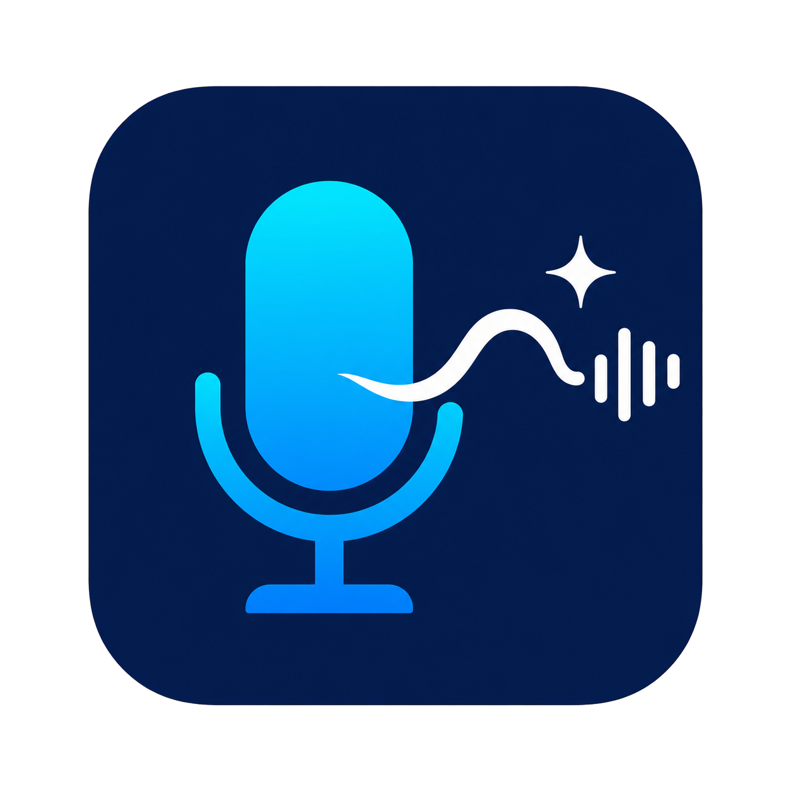
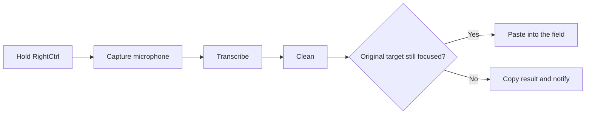

# Whispdows

<div align="center">
  
  <h3>Hold a key. Speak naturally. Keep typing.</h3>
  <p>A fast, tray-first voice layer for every text field on Windows.</p>
  <p>
    
    
    
    
  </p>
</div>

Whispdows is a small Windows tray application for hold-to-talk AI dictation. Hold `RightCtrl`, speak, release, and the cleaned result is pasted into the field that was active when you started.

It is deliberately quiet: no editor window, no browser extension, no background service, no transcript history, and no runtime model download.

## The loop



## Why it feels good

| Capability | What happens |
| --- | --- |
| Hold-to-talk | A global shortcut starts recording and release ends it. `Escape` cancels. |
| Local first | Whisper `small.en` runs on-device when local transcription is selected. |
| Cloud when useful | Azure Speech, OpenAI, Groq, and Azure OpenAI are supported through explicit settings. |
| Natural cleanup | Filler words, false starts, punctuation, and obvious transcription mistakes are cleaned without summarising your words. |
| Corrections survive | Clear spoken corrections such as “actually, use Tuesday” can replace the superseded phrase. |
| Focus-safe paste | Whispdows remembers the original target. If focus changes, it leaves the result on the clipboard instead of pasting into the wrong app. |
| Clipboard respect | Existing clipboard contents are restored unless another application changed them after Whispdows wrote the result. |
| Tray-native | State is visible through the notification-area icon and a small processing pill. |
| Release-ready | The packaged build includes the .NET runtime, native Whisper runtime, and verified model. |

## Quick start

### Requirements

- Windows 11 x64
- .NET 10 SDK
- PowerShell
- A microphone

### Run from source

```powershell
git clone https://github.com/rogersau/Whispdows.git
Set-Location Whispdows

If you are renaming an existing Dictate installation, copy these files manually
before launching Whispdows for the first time:

```powershell
New-Item -ItemType Directory -Force "$env:LOCALAPPDATA\Whispdows"
Copy-Item "$env:LOCALAPPDATA\Dictate\settings.json" "$env:LOCALAPPDATA\Whispdows\settings.json"
Copy-Item "$env:LOCALAPPDATA\Dictate\.env" "$env:LOCALAPPDATA\Whispdows\.env"
```

.\scripts\Get-WhisperModel.ps1
dotnet test .\Whispdows.sln --configuration Release
dotnet run --project .\src\Whispdows\Whispdows.csproj
```

Whispdows starts without a normal window. Look in the notification area, enable dictation from the tray menu, focus any editable field, and hold `RightCtrl`.

### Build a self-contained release

Install the .NET 10 SDK and [Inno Setup](https://jrsoftware.org/isinfo.php), then run:

```powershell
.\scripts\Build-Release.ps1 -Version 0.1.0
```

The output is written to:

```text
artifacts\publish\win-x64\
artifacts\installer\Whispdows-Setup.exe
```

The installer is per-user and does not require administrator access. It installs to `%LOCALAPPDATA%\Programs\Whispdows`; settings, secrets, and logs remain under `%LOCALAPPDATA%\Whispdows` so upgrades do not overwrite them.

## Configure it

Whispdows creates these files on first start:

```text
%LOCALAPPDATA%\Whispdows\settings.json
%LOCALAPPDATA%\Whispdows\.env
```

The complete checked-in settings shape is in [`settings.example.json`](settings.example.json). The secrets file is intentionally simple and is ignored by Git:

```dotenv
OPENAI_API_KEY=
GROQ_API_KEY=
AZURE_SPEECH_KEY=
```

Only add the keys for providers you select. Never commit a real key.

### Transcription providers

| Provider | Setting | Notes |
| --- | --- | --- |
| `local` | `transcription.provider` | Whisper `small.en` through Whisper.net. |
| `azure` | `transcription.provider` | Azure Speech Fast Transcription; configure `azureRegion` and `azureLocale`. |
| `openai` | `transcription.provider` | OpenAI-compatible transcription; configure `openaiModel`. |
| `groq` | `transcription.provider` | Groq-hosted transcription; configure `groqModel`. |

Cloud transcription can fall back to the local model when `fallbackToLocal` is enabled. Failed cloud calls are not retried.

### Cleanup providers

Cleanup is independent of transcription:

| Provider | Behavior |
| --- | --- |
| `basic` | Local, deterministic cleanup for whitespace, fillers, and sentence casing. |
| `none` | Paste the transcript without cleanup. |
| `openai` / `groq` | Send the transcript to a Chat Completions model. |
| `azure-openai` | Send the transcript to an Azure OpenAI deployment through the Responses API. |

For Azure OpenAI, use the Azure resource's v1 endpoint and deployment name:

```json
{
  "transcription": {
    "provider": "azure",
    "azureRegion": "australiaeast",
    "azureLocale": "en-AU",
    "fallbackToLocal": false
  },
  "cleanup": {
    "provider": "azure-openai",
    "model": "gpt-5.4-nano",
    "azureEndpoint": "https://<resource>.services.ai.azure.com/openai/v1",
    "fallbackToBasic": true
  }
}
```

The Azure OpenAI cleanup provider reuses `AZURE_SPEECH_KEY`, so a Speech resource key can serve both configured Azure operations when the resource supports them. The request sets `store` to `false`; the app still sends the raw transcript and fixed cleanup instructions to Azure for processing.

When `fallbackToBasic` is enabled, a missing key, timeout, API error, or malformed response falls back to deterministic local cleanup so a successful transcript is not discarded.

### Settings window

Right-click the tray icon and choose **Settings…** to edit the configuration without opening JSON. The editor groups the hotkey, audio, transcription, cleanup, and paste controls; provider-specific fields appear only when they are relevant. **Save & Apply** validates the complete candidate, swaps the runtime pipeline, persists the file, and rolls back to the last working configuration if anything fails. API keys remain in `.env` and are never displayed in the editor.

**Reload settings** remains available for changes made directly in `settings.json` or `.env`, while **Open settings folder** is useful for inspecting those files.

## Everyday behavior

- Hold the configured shortcut—`RightCtrl` by default—to record.
- Release it to transcribe, clean, and paste.
- Press `Escape` while recording to cancel.
- Recordings shorter than 250 ms are discarded.
- Capture stops at `audio.maxSeconds`.
- `[BLANK_AUDIO]` responses are discarded as empty input.
- Repeated shortcut presses are ignored while a recording is processing.
- If the target changes, the result stays on the clipboard and Whispdows shows `Copied — target changed`.
- If the target is running as administrator and Whispdows is not, Windows may block automatic input; use the clipboard result manually.

The cleanup prompt is intentionally conservative. It removes filler and abandoned starts, repairs punctuation, preserves names and technical terms, and handles clear corrections without turning dictation into a summary or an answer.

## Windows notes

For microphone access, enable **Settings → Privacy & security → Microphone → Let desktop apps access your microphone**.

The physical `Fn` key is usually handled by keyboard firmware and may not be visible to Windows. If needed, map a hardware button to `F13` and use that as the Whispdows shortcut.

Whispdows uses a global low-level keyboard hook and `SendInput` for paste. It does not require Accessibility or Input Monitoring permissions. It remains a non-elevated application by design.

## Privacy model

- Audio and transcripts are held in memory and released after processing or cancellation.
- With local transcription plus `basic` or `none` cleanup, no audio or transcript is sent over the network.
- Cloud transcription sends the completed WAV recording to the selected provider.
- Cloud cleanup sends only the transcript and fixed cleanup instructions—not surrounding app content, clipboard context, or window contents.
- There is no telemetry, analytics, remote logging, crash reporting, or transcript history.
- Local logs contain state, durations, provider names, and exception types only. They do not contain audio, transcript text, clipboard contents, request bodies, API keys, or authorization headers.
- API keys live in the user-owned plain-text `.env` file, which is excluded from Git.

The unsigned personal installer may trigger Microsoft Defender SmartScreen. Build from source or code-sign the release where practical; do not disable Defender, SmartScreen, or antivirus protection globally.

## Project map

```text
src/Whispdows/
├── AudioRecorder.cs          WASAPI capture and WAV output
├── Transcribers.cs            local Whisper pipeline and orchestration
├── CloudProviders.cs          OpenAI, Groq, and Azure OpenAI clients
├── AzureSpeechTranscriber.cs  Azure Speech client
├── TextCleaners.cs            deterministic cleanup
├── TextInserter.cs            clipboard-safe focus-aware paste
├── TrayMenu.cs                notification-area controls
└── DictationState.cs          recording → transcription → cleanup → paste state machine
```

## Development checks

Run the full automated suite:

```powershell
dotnet test .\Whispdows.sln --configuration Release --nologo --verbosity minimal
```

The manual packaged-app checks live in [`tests/manual-smoke-checklist.md`](tests/manual-smoke-checklist.md). They cover installation, lifecycle, Notepad/browser/Teams/VS Code targets, focus changes, elevated targets, microphone permissions, cloud fallback, and log privacy.

## License

No license has been selected for this repository yet. Until one is added, treat the source as public for viewing but do not assume permission to redistribute or reuse it.
