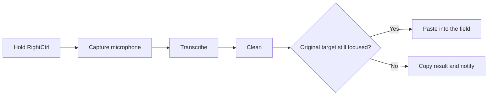
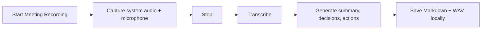

# Whispdows

<div align="center">
  
  <h3>Dictation and private meeting notes from the Windows tray.</h3>
  <p>Hold a key to type, or record system audio and your microphone into local notes.</p>
  <p>
    
    
    
    
  </p>
</div>

Whispdows is a small Windows tray application for hold-to-talk AI dictation and
Granola-style meeting notes. Hold `RightCtrl`, speak, release, and the cleaned
result is pasted into the field that was active when you started. Or choose
**Start Meeting Recording** to capture system audio plus your microphone and
produce a private Markdown note.

There are no accounts, cloud storage, telemetry, browser extensions, or
Whispdows background service. It is deliberately quiet: no editor window, no
transcript history, or silent model downloads. Meeting files stay under
`~/MeetingNotes` by default. Network traffic occurs only when you explicitly
configure an OpenAI or Groq provider.

## The loop





## Why it feels good

| Capability | What happens |
| --- | --- |
| Hold-to-talk | A global shortcut starts recording and release ends it. `Escape` cancels. |
| Local first | Whisper `small.en` runs on-device when local transcription is selected. |
| Meeting notes | WASAPI loopback and microphone capture are mixed into a local WAV; Whisper `medium.en` transcribes it. |
| Structured output | Every successful meeting note has five summary bullets, decisions, owned action items, and the full transcript. |
| Failure-safe | If transcription or note generation fails, Whispdows preserves the audio and any available transcript. |
| Tiny local cleanup | An optional Ollama model can polish transcripts on-device without a cloud API key. |
| Cloud when useful | Azure Speech, OpenAI, Groq, and Azure OpenAI are supported through explicit settings. |
| Natural cleanup | Filler words, false starts, punctuation, and obvious transcription mistakes are cleaned without summarising your words. |
| Corrections survive | Clear spoken corrections such as “actually, use Tuesday” can replace the superseded phrase. |
| Focus-safe paste | Whispdows remembers the original target. If focus changes, it leaves the result on the clipboard instead of pasting into the wrong app. |
| Clipboard respect | Existing clipboard contents are restored unless another application changed them after Whispdows wrote the result. |
| Tray-native | State is visible through the notification-area icon and a small processing pill. |
| Release-ready | The packaged build includes the .NET runtime, native Whisper runtime, and verified model. |

## Quick start

### Requirements

- Windows 11 x64
- .NET 10 SDK
- PowerShell
- A microphone
- An active Windows playback device for meeting system-audio capture
- Optional [Ollama for Windows](https://docs.ollama.com/windows) and a local
  chat model for fully offline meeting summaries and AI cleanup; the packaged
  installer can offer to install Ollama.

### Run from source

```powershell
git clone https://github.com/rogersau/Whispdows.git
Set-Location Whispdows
```

If you are renaming an existing Dictate installation, copy these files manually before launching Whispdows for the first time:

```powershell
New-Item -ItemType Directory -Force "$env:LOCALAPPDATA\Whispdows"
Copy-Item "$env:LOCALAPPDATA\Dictate\settings.json" "$env:LOCALAPPDATA\Whispdows\settings.json"
```

Open **Settings…** after launch and enter provider keys there. If a legacy
`.env` is already present under `%LOCALAPPDATA%\Whispdows`, Whispdows imports it
on launch, encrypts non-empty values for the current Windows user, and clears
the plaintext values.

Download the local Whisper models and run the application:

```powershell
.\scripts\Get-WhisperModel.ps1
.\scripts\Get-WhisperModel.ps1 -Model medium.en
dotnet test .\Whispdows.sln --configuration Release
dotnet run --project .\src\Whispdows\Whispdows.csproj
```

Whispdows starts without a normal window. Use the notification-area menu to
enable dictation or start/stop a meeting recording.

### Build a self-contained release

Install the .NET 10 SDK and [Inno Setup](https://jrsoftware.org/isinfo.php), then run:

```powershell
.\scripts\Build-Release.ps1 -Version 0.1.0
```

The output is written to:

```text
artifacts\publish\win-x64\
artifacts\installer\Whispdows-Setup.exe
```

The installer asks you to select **Transcribe only**, **Meeting Notes only**, or
**Transcribe and Meeting Notes**. It installs only the corresponding Whisper
model(s). The installer is per-user and does not require administrator access.
It installs to `%LOCALAPPDATA%\Programs\Whispdows`; settings, encrypted secrets,
and logs remain under `%LOCALAPPDATA%\Whispdows` so upgrades do not overwrite
them. Meeting audio and notes remain in your selected MeetingNotes directory.

If Ollama is not already installed, the installer offers an unchecked **Install Ollama for local AI cleanup** task. Selecting it installs the official `Ollama.Ollama` package through Windows Package Manager. The task is hidden when `ollama.exe` is already available, does not download a model, and never removes Ollama when Whispdows is uninstalled. If Windows Package Manager is unavailable, the installer offers to open Ollama's official Windows instructions instead.

Every push to `master` also runs the [Package Windows app](https://github.com/rogersau/Whispdows/actions/workflows/package-windows.yml) workflow. Download `Whispdows-Setup.exe` from the workflow run's artifact to install the latest build.

## Configure it

Whispdows creates these files on first start:

```text
%LOCALAPPDATA%\Whispdows\settings.json
%LOCALAPPDATA%\Whispdows\secrets.dat
```

The complete checked-in settings shape is in [`settings.example.json`](settings.example.json). `secrets.dat` is encrypted with Windows DPAPI for the current user and must not be edited manually. Use the **API keys** section in **Settings…** to add, replace, or clear OpenAI, Groq, and Azure keys. Keys are never displayed in the editor or written to `settings.json`.

For compatibility with scripts, you may create
`%LOCALAPPDATA%\Whispdows\.env` before launch or **Reload settings**:

```dotenv
OPENAI_API_KEY=
GROQ_API_KEY=
AZURE_SPEECH_KEY=
```

Whispdows merges non-empty values into `secrets.dat` using Windows DPAPI and
then clears the plaintext values from `.env`. Empty `.env` entries do not erase
keys already in secure storage; use **Settings…** to clear a key.

### Transcription providers

| Provider | Setting | Notes |
| --- | --- | --- |
| `local` | `transcription.provider` | Whisper `small.en` through Whisper.net. |
| `azure` | `transcription.provider` | Azure Speech Fast Transcription; configure `azureRegion` and `azureLocale`. |
| `openai` | `transcription.provider` | OpenAI-compatible transcription; configure `openaiModel`. |
| `groq` | `transcription.provider` | Groq-hosted transcription; configure `groqModel`. |

Cloud transcription can fall back to the local model when `fallbackToLocal` is enabled. Failed cloud calls are not retried.

### Meeting Notes

Use **Start Meeting Recording** in the tray menu. While a meeting is active,
Whispdows temporarily pauses the dictation hotkey so the two capture workflows
cannot fight over the microphone. On stop it:

1. mixes the default Windows playback device and selected microphone into a
   16 kHz mono WAV;
2. selects OpenAI or Groq transcription when the matching key is configured,
   otherwise uses local whisper.cpp with `ggml-medium.en.bin`;
3. sends ten-minute chunks for cloud transcription so normal meetings stay
   below upload limits;
4. asks the configured LLM for exactly five summary bullets, decisions, and
   action items with owners; and
5. saves `YYYY-MM-DD-HHMM.md` and `YYYY-MM-DD-HHMM.wav` side by side.

The default output is:

```text
%USERPROFILE%\MeetingNotes\
```

Successful Markdown has the summary, decisions, and action items at the top,
then `---`, then the full transcript. A same-minute collision receives `-02`,
`-03`, and so on; existing notes are never overwritten.

The `meetingNotes.transcriptionProvider` setting accepts `auto`, `local`,
`openai`, or `groq`. The `meetingNotes.notesProvider` setting accepts `auto`,
`openai`, `groq`, or `ollama`. In `auto` mode, a configured OpenAI key is
preferred, then Groq, then the local models. The default local LLM endpoint is
the loopback-only Ollama endpoint `http://127.0.0.1:11434` and the default model
is `llama3.2:3b`; install it separately:

Edit meeting-specific values in `settings.json`, then choose **Reload
settings** from the tray. API keys remain managed through **Settings…** or
`.env`.

```powershell
ollama pull llama3.2:3b
```

To operate fully offline, install both local models, set
`meetingNotes.transcriptionProvider` to `local`, set
`meetingNotes.notesProvider` to `ollama`, and do not configure cloud keys.
Whispdows does not install or start Ollama for you.

### Cleanup providers

Cleanup is independent of transcription:

| Provider | Behavior |
| --- | --- |
| `basic` | Local, deterministic cleanup for whitespace, fillers, and sentence casing. |
| `ollama` | Send only the transcript and cleanup instructions to an Ollama model on this PC. |
| `none` | Paste the transcript without cleanup. |
| `openai` / `groq` | Send the transcript to a Chat Completions model. |
| `azure-openai` | Send the transcript to an Azure OpenAI deployment through the Responses API. |

#### Tiny local AI cleanup

Whispdows supports Ollama through its local OpenAI-compatible endpoint. It accepts only a loopback address (`127.0.0.1`, `localhost`, or `::1`) and sends no API key. The desktop application never starts Ollama or downloads models; the packaged Whispdows installer can optionally install the Ollama runtime when it is missing.

Install Ollama, then pull one model:

```powershell
# Recommended balance: about 815 MB in Ollama
ollama pull gemma3:1b

# Smallest preset: about 292 MB, with a larger quality trade-off
ollama pull gemma3:270m

# Qwen alternatives
ollama pull qwen2.5:0.5b
ollama pull qwen2.5:1.5b
ollama pull qwen3:1.7b
```

Gemma 3 1B is the default recommendation for short transcript edits. The 270M model is exceptionally small but is more likely to miss a false start or meaning-sensitive correction. Qwen remains fully supported: select a preset in Settings or enter any installed model name.

Choose **Local AI model (Ollama)** in Settings, or configure it directly:

```json
{
  "cleanup": {
    "provider": "ollama",
    "localModel": "gemma3:1b",
    "localEndpoint": "http://127.0.0.1:11434/v1",
    "style": "auto",
    "fallbackToBasic": true
  }
}
```

Whispdows uses Ollama's `/v1/chat/completions` compatibility route, disables streaming, and limits the response size. If Ollama is stopped, the model is missing, the response is malformed, or the local request times out, `fallbackToBasic` preserves the transcript through deterministic cleanup.

For Azure OpenAI, use the Azure resource's v1 endpoint and deployment name:

```json
{
  "transcription": {
    "provider": "azure",
    "azureRegion": "australiaeast",
    "azureLocale": "en-AU",
    "fallbackToLocal": false
  },
  "cleanup": {
    "provider": "azure-openai",
    "model": "gpt-5.4-nano",
    "azureEndpoint": "https://<resource>.services.ai.azure.com/openai/v1",
    "fallbackToBasic": true
  }
}
```

The Azure OpenAI cleanup provider reuses `AZURE_SPEECH_KEY`, so a Speech resource key can serve both configured Azure operations when the resource supports them. The request sets `store` to `false`; the app still sends the raw transcript and fixed cleanup instructions to Azure for processing.

When `fallbackToBasic` is enabled, a missing key or model, timeout, connection failure, API error, or malformed response falls back to deterministic local cleanup so a successful transcript is not discarded.

### Settings window

Double-click the tray icon, or right-click it and choose **Settings…**, to edit the configuration without opening JSON. The editor can record a key or key combination for the hold-to-talk shortcut, offers a dropdown of active capture devices, groups the hotkey, audio, transcription, cleanup, paste, and API-key controls, and shows provider-specific fields only when they are relevant. **Save & Apply** validates the complete candidate, swaps the runtime pipeline, persists the settings and encrypted keys, and rolls back to the last working configuration if anything fails.

**Reload settings** remains available for changes made directly in `settings.json` or the encrypted key store, while **Open settings folder** is useful for inspecting the non-secret settings file and logs.

## Everyday behavior

- Hold the configured shortcut—`RightCtrl` by default—to record.
- Release it to transcribe, clean, and paste.
- Press `Escape` while recording to cancel.
- Recordings shorter than 250 ms are discarded.
- Capture stops at `audio.maxSeconds`.
- `[BLANK_AUDIO]` responses are discarded as empty input.
- Repeated shortcut presses are ignored while a recording is processing.
- If the target changes, the result stays on the clipboard and Whispdows shows `Copied — target changed`.
- If the target is running as administrator and Whispdows is not, Windows may block automatic input; use the clipboard result manually.
- Choose **Start Meeting Recording** and **Stop Meeting Recording** from the tray for meetings.
- Meeting processing can take several minutes with the local medium model.
- Choose **Open MeetingNotes folder** from the tray to inspect the saved Markdown and WAV.

The cleanup prompt is intentionally conservative. It removes filler and abandoned starts, repairs punctuation, preserves names and technical terms, and handles clear corrections without turning dictation into a summary or an answer.

## Windows notes

For microphone access, enable **Settings → Privacy & security → Microphone →
Let desktop apps access your microphone**. Whispdows uses standard Windows
WASAPI loopback for system audio; unlike macOS screen-audio capture, Windows
does not present a separate screen-recording permission prompt. Keep an active
default playback device selected. Protected DRM audio may be silent and is not
bypassed.

The physical `Fn` key is usually handled by keyboard firmware and may not be visible to Windows. If needed, map a hardware button to `F13` and use that as the Whispdows shortcut.

Whispdows uses a global low-level keyboard hook and `SendInput` for paste. It does not require Accessibility or Input Monitoring permissions. It remains a non-elevated application by design.

## Privacy model

- Dictation audio and transcripts are held in memory and released after processing or cancellation.
- Meeting capture uses temporary local files, then keeps only the final Markdown and WAV in the configured MeetingNotes directory.
- With local transcription plus `basic` or `none` cleanup, no audio or transcript is sent over the network.
- Fully local meeting mode sends nothing over the network: whisper.cpp transcribes and Ollama generates the notes over a loopback connection.
- Cloud meeting transcription sends bounded WAV chunks to the selected OpenAI or Groq provider.
- Cloud meeting-note generation sends the full transcript to the selected OpenAI or Groq provider.
- Ollama cleanup sends the transcript and fixed instructions only to the configured loopback endpoint, so they do not leave the PC.
- Cloud transcription sends the completed WAV recording to the selected provider.
- Cloud cleanup sends only the transcript and fixed cleanup instructions—not surrounding app content, clipboard context, or window contents.
- There is no account system, cloud storage, sync, telemetry, analytics, remote logging, or crash reporting.
- Local logs contain state, durations, provider names, and exception types only. They do not contain audio, transcript text, clipboard contents, request bodies, API keys, or authorization headers.
- API keys are stored in `secrets.dat`, encrypted with Windows DPAPI using the current user profile; they are not written to `settings.json` or logs.

The unsigned personal installer may trigger Microsoft Defender SmartScreen. Build from source or code-sign the release where practical; do not disable Defender, SmartScreen, or antivirus protection globally.

## Project map

```text
src/Whispdows/
├── AudioRecorder.cs          WASAPI capture and WAV output
├── MeetingAudioRecorder.cs   file-backed microphone + system-audio capture
├── MeetingNotesController.cs record → transcribe → generate → archive workflow
├── MeetingNotesGeneration.cs OpenAI/Groq/Ollama structured-note adapters
├── MeetingNotesArchive.cs    local Markdown and WAV persistence
├── ChunkingTranscriber.cs    bounded cloud transcription chunks
├── Transcribers.cs            local Whisper pipeline and orchestration
├── CloudProviders.cs          OpenAI, Groq, and Azure OpenAI clients
├── OllamaTextCleaner.cs       loopback-only local AI cleanup adapter
├── AzureSpeechTranscriber.cs  Azure Speech client
├── TextCleaners.cs            deterministic cleanup
├── TextInserter.cs            clipboard-safe focus-aware paste
├── TrayMenu.cs                notification-area controls
└── DictationState.cs          recording → transcription → cleanup → paste state machine
```

## Development checks

Run the full automated suite:

```powershell
dotnet test .\Whispdows.sln --configuration Release --nologo --verbosity minimal
```

The manual packaged-app checks live in [`tests/manual-smoke-checklist.md`](tests/manual-smoke-checklist.md). They cover installation, lifecycle, Notepad/browser/Teams/VS Code targets, focus changes, elevated targets, microphone permissions, cloud fallback, and log privacy.

## License

No license has been selected for this repository yet. Until one is added, treat the source as public for viewing but do not assume permission to redistribute or reuse it.
