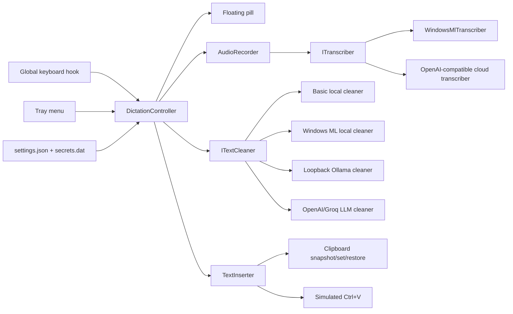

# Whispdows: Lean Windows AI Dictation Tool Design

**Status:** Implemented migration baseline
**Target:** Windows 11 24H2 (build 26100+), x64 or ARM64, one user, per-user installation
**Working name:** `Whispdows`

## 1. Design summary

Build this as one small Windows tray application. It is not a service, does not need a database, does not need an account, and does not run a local web server.

Recommended implementation:

- **C# on .NET 10 LTS**
- **WPF** for the recording pill and minimal Windows UI
- **`System.Windows.Forms.NotifyIcon`** for the Windows notification-area menu
- **NAudio/WASAPI** for microphone capture
- **Windows ML** with **Foundry Local** catalog models for on-device transcription and cleanup, with automatic NPU/GPU/CPU execution-provider selection
- Direct `HttpClient` calls for the OpenAI-compatible Groq/OpenAI transcription endpoints
- A low-level Windows keyboard hook for hold-to-talk key-down and key-up events
- Clipboard replacement plus simulated `Ctrl+V` for insertion
- A self-contained, per-user **Inno Setup** installer

The default build uses the Foundry Local aliases `whisper-tiny` for transcription and `qwen2.5-0.5b` for cleanup. Models and execution-provider packages are downloaded lazily on first local use, cached under `%LOCALAPPDATA%\Whispdows\windowsml`, and kept available through the process lifetime.

### Local-first model policy

Windows ML is the primary local inference path. Foundry Local owns model discovery, download, caching, and execution-provider registration; Windows ML selects the best available NPU, GPU, or CPU path for the machine. The app does not download model files during installation or startup.

The tool works offline after the first local model/runtime download:

1. Windows ML transcribes the audio with the configured Whisper catalog alias.
2. Windows ML cleans the transcript with the configured local language-model alias.
3. The result is pasted.

If local inference is unavailable or fails, the configured online provider can be used as an explicit fallback. The older GGML/Whisper.net and Ollama paths remain compatibility options, but are not the default design.

## 2. Goals

The application must:

- Run quietly in the background.
- Start recording when a configured shortcut is pressed and held.
- Stop recording when the trigger key is released.
- Show a small, non-activating floating pill while recording.
- Transcribe using either:
  - Windows ML locally; or
  - OpenAI/Groq, selected explicitly in configuration.
- Optionally clean the transcript with Windows ML, Ollama, or a cloud LLM.
- Paste into the application that was active when dictation began.
- Restore the previous clipboard after pasting where possible.
- Offer an on/off toggle and launch-at-login toggle in the Windows notification area.
- Store settings locally in readable files.
- Send no telemetry and retain no audio or transcript history.
- Be installable with one standalone setup executable.

## 3. Non-goals

Do not build these in version 1:

- Accounts, sign-in, sync, teams, or multi-user support
- A Windows service
- A browser extension
- A database
- A web dashboard or local web server
- Continuous or streaming live transcription
- Transcript history
- Audio history
- Automatic updates
- A full editor or history surface beyond the focused settings window
- App-specific integrations for Teams, Outlook, browsers, or editors
- Reading surrounding text from the focused application
- Code-specific dictation commands
- Spoken command grammars such as “select previous paragraph”
- GPU/CUDA setup
- macOS or Linux support
- A bundled local LLM

## 4. User experience

### Normal flow

1. `Whispdows` starts in the Windows notification area.
2. The user places the cursor in any normal text field.
3. The user holds the configured shortcut, initially `RightCtrl`.
4. A pill appears near the bottom centre of the active monitor:

   `● Listening…`

5. The user speaks.
6. The user releases the trigger key.
7. The pill changes to:

   `◌ Transcribing…`

8. The audio is transcribed and optionally cleaned.
9. The final text is pasted into the original target application.
10. The previous clipboard is restored and the pill disappears.

### Focus safety

The foreground window handle is captured when recording starts. The pill never takes focus.

Before insertion, the app checks that the same target window is still active. If focus changed while transcription was running, it does **not** force focus back or paste into the newly selected application. It places the result on the clipboard and shows:

`Copied — target changed`

This avoids text unexpectedly appearing in the wrong window.

### Cancel and busy behaviour

- Pressing `Escape` while recording cancels the current recording.
- A new hotkey press is ignored while an existing dictation is being processed.
- Recordings shorter than about 250 ms are discarded.
- Recording stops automatically at the configured maximum, initially 90 seconds.

## 5. Windows hotkey decision

### Do not promise direct `Fn` support

On most Windows laptops, the physical `Fn` key is handled by keyboard firmware and does not reach Windows as a normal virtual key or scan code. Therefore, the app cannot reliably offer raw `Fn` as a universal hotkey.

Use a configurable normal Windows key or chord instead. Recommended options are:

- `RightCtrl` — simplest default
- `Ctrl+Win+Space`
- `F13` — useful when a mouse, keyboard, Stream Deck, AutoHotkey, or OEM utility can map a physical button to it

If the user’s keyboard utility can remap `Fn` to `F13`, `F13` can then be configured in `settings.json`.

### Implementation

Use `SetWindowsHookEx` with `WH_KEYBOARD_LL`, not `RegisterHotKey`.

`RegisterHotKey` is appropriate for one-shot activation but does not provide the complete key-down/key-up lifecycle needed for hold-to-talk. The low-level hook should:

- Track only the configured modifiers and trigger key.
- Start recording on the first non-repeat trigger-key down.
- Stop recording on trigger-key up.
- Suppress the configured shortcut while it is being used for dictation so it does not leak into the target application.
- Immediately dispatch work to the WPF dispatcher and return from the hook callback.
- Never record or log unrelated keys.

For a chord such as `Ctrl+Win+Space`, recording begins when `Space` goes down while the required modifiers are held and ends when `Space` is released.

## 6. Architecture



### Single orchestration class

`DictationController` owns the workflow and state. Avoid an event bus, dependency-injection framework, background worker service, mediator library, or message broker.

It coordinates these small components:

- `HotkeyHook`
- `AudioRecorder`
- `ITranscriber`
- `ITextCleaner`
- `TextInserter`
- `PillWindow`
- `TrayMenu`
- `SettingsLoader`

Use constructor injection manually in `App.xaml.cs`. Two interfaces are enough: `ITranscriber` and `ITextCleaner`.

## 7. Application state

Use a small explicit state machine:

```text
Disabled
   ↕ tray toggle
Idle
   ↓ hotkey down
Recording
   ↓ hotkey up
Transcribing
   ↓ transcript received
Cleaning
   ↓ cleaned text received
Pasting
   ↓ complete
Idle
```

Any stage can move to `Error`, display a short message, then return to `Idle`.

The controller must guarantee that only one dictation session exists at a time.

## 8. Component design

### 8.1 App host and tray menu

The WPF application starts without a normal main window and remains alive through the tray icon.

Tray menu:

```text
✓ Enabled
  Launch at login
  Reload settings
  Open settings folder
  Open README
──────────────
  Exit
```

Behaviour:

- `Enabled` installs or removes the keyboard hook.
- `Launch at login` writes or removes a per-user `HKCU\Software\Microsoft\Windows\CurrentVersion\Run` value.
- `Reload settings` validates and reloads `settings.json` and the encrypted `secrets.dat` store without restarting.
- `Open settings folder` opens `%LOCALAPPDATA%\Whispdows`.
- `Settings…` opens the graphical editor for the hotkey, audio device, providers, paste behavior, and encrypted API keys.

### 8.2 Audio recorder

Use NAudio with WASAPI shared-mode capture from the current Windows default input device.

Recording rules:

- Use the default microphone unless `audio.deviceId` is set.
- Capture to memory, not a permanent file.
- Convert to mono, 16 kHz, 16-bit PCM WAV after recording.
- Keep a hard maximum duration to prevent accidental unlimited recording.
- Dispose the capture device and buffers in `finally` blocks.
- Never retain audio after the transcription attempt finishes.

A 90-second mono 16 kHz 16-bit recording is only a few megabytes, so an in-memory stream is sufficient and avoids temporary audio files.

### 8.3 Windows ML transcription

Implement `WindowsMlTranscriber` over a shared `WindowsMlRuntime` that owns Foundry Local manager/catalog/model lifecycle.

Reasons:

- Windows ML can select the best available NPU, GPU, or CPU execution provider.
- Foundry Local owns model discovery, download, registration, and per-user caching.
- The model can stay loaded between dictations without a separate localhost process.
- The provider seam keeps fallback behavior independent from model/runtime details.

Behaviour:

- Resolve the configured catalog alias lazily on first use.
- Download and load the model through Foundry Local, then reuse it until application exit.
- Process one recording at a time through a live transcription session.
- Set the language to English by default; allow `auto` or another language in settings.
- Return plain text with no timestamps.
- Support cancellation on application exit.

Default model:

- `whisper-tiny`, configurable by alias through `transcription.windowsMlModel`.

Do not build a model-file picker UI. The model is selected by Foundry Local catalog alias. The older `WhisperCppTranscriber` and GGML model path remain only for existing configurations and are not the primary design.

### 8.4 Cloud transcription

Implement one `OpenAiCompatibleTranscriber` with provider-specific base URL, API key, and model name, plus an `AzureSpeechTranscriber` for Azure's Fast Transcription REST API.

Providers:

- `openai`
- `groq`
- `azure`

All receive the completed WAV recording through a multipart `POST` to their transcription endpoint. Keep OpenAI-compatible model names configurable because providers change their recommended models over time. Azure uses its region-scoped Speech resource key, region identifier, and locale.

Suggested initial values as of July 2026:

- OpenAI: `gpt-4o-transcribe`
- Groq: `whisper-large-v3-turbo`

No provider is selected automatically. The `transcription.provider` setting is authoritative.

Recommended failure policy:

- If a Windows ML request fails and `fallbackToOnline` is `true`, run the configured online transcriber.
- If a cloud request fails and `fallbackToLocal` is `true`, run the configured local fallback.
- If the required API key is missing, show a configuration error immediately rather than attempting a request.
- Use a bounded HTTP timeout.
- Do not repeatedly retry and create duplicate API charges.

### 8.5 Transcript cleanup

Define:

```csharp
interface ITextCleaner
{
    Task<string> CleanAsync(string transcript, CancellationToken cancellationToken);
}
```

Implement deterministic, local-AI, and cloud cleaners behind the same interface.

#### `WindowsMlTextCleaner`

Use the Foundry Local chat client with the configured `qwen2.5-0.5b` catalog alias by default. Send only the raw transcript and the fixed cleanup prompt. Load the model lazily and keep it available through the process lifetime.

#### `BasicTextCleaner`

Used for fully offline operation and as the failure fallback. It should only:

- Trim leading/trailing whitespace.
- Collapse repeated spaces.
- Remove immediately repeated filler tokens such as `um um` or `uh uh`.
- Remove a leading standalone `um`, `uh`, or `erm` when safe.
- Capitalise the first character when `style` is `sentence`.
- Add final punctuation only when `style` is `sentence` and the text does not already end with punctuation.

It must not broadly rewrite text because regex-based “smart” cleanup can silently alter meaning.

#### `LlmTextCleaner`

Use OpenAI or Groq according to settings. Send only the raw transcript and a fixed, short system prompt.

#### `OllamaTextCleaner`

Use the same Chat Completions cleanup module through an unauthenticated, loopback-only OpenAI-compatible endpoint. Keep the model name and base endpoint configurable, default to `gemma3:1b`, use the provider-compatible `max_tokens` field, disable streaming, and allow a longer cold-start timeout. Do not launch Ollama, pull a model, or make a network request during settings validation.

Recommended prompt:

```text
You clean voice dictation transcripts.

Return only the corrected text.
- Remove filler words and abandoned false starts only when meaning is unchanged.
- Fix punctuation, spacing, and obvious transcription mistakes.
- Preserve the speaker's wording, intent, names, numbers, URLs, and technical terms.
- Do not summarise, answer, explain, or add information.
- Match casing to the apparent dictation style. Use normal sentence case for prose,
  preserve intentional capitals, and keep short casual fragments natural.
```

Request settings:

- Low temperature or equivalent deterministic setting
- Small output limit based on input length
- No conversation history
- No tools
- No app context or surrounding text

Failure policy:

- On timeout, API error, malformed response, or missing key, run `BasicTextCleaner` and continue.
- Never discard a successful transcript merely because cleanup failed.

### 8.6 Text insertion

Use clipboard plus simulated `Ctrl+V` as the only insertion method in version 1.

Algorithm:

1. Confirm the original target window is still foreground.
2. Take a best-effort snapshot of the existing clipboard `IDataObject`.
3. Put the final text on the clipboard as Unicode text.
4. Immediately record the clipboard sequence number produced by that write as `ownedSequence`.
5. Send `Ctrl+V` with Win32 `SendInput`.
6. Wait a short configurable delay, initially 175 ms.
7. Restore the old clipboard only when:
   - clipboard restoration is enabled;
   - the current clipboard sequence still equals `ownedSequence`; and
   - the clipboard still contains the app’s inserted value.
8. If another application or the user changes the clipboard, do not overwrite that newer value.
9. If insertion cannot be confirmed or restoration fails, leave the dictated text on the clipboard and show `Copied`.

Clipboard access should retry a few times over a short period because another process may temporarily have it open.

#### Known Windows limitation

A normally running app cannot inject input into a target running at a higher integrity level. Therefore, pasting into an application running “as administrator” can fail. Do not make `Whispdows` run elevated by default. Leave the result on the clipboard in this case.

### 8.7 Floating pill

Use one borderless WPF `Window`:

- Around 160 × 36 device-independent pixels
- Rounded corners
- Topmost
- No taskbar entry
- `ShowActivated = false`
- Not focusable
- Extended styles `WS_EX_NOACTIVATE` and `WS_EX_TOOLWINDOW`
- Optional click-through style
- Positioned at the bottom centre of the monitor containing the target window

States:

- `● Listening…`
- `◌ Transcribing…`
- `◌ Cleaning…`
- `✓ Pasted`
- `Copied`
- `No speech detected`
- A concise error such as `Microphone unavailable`

Do not add waveforms, animated audio visualisers, transcript previews, draggable positioning, or a full overlay framework.

## 9. Configuration

### Paths

Standard install:

```text
Application:
%LOCALAPPDATA%\Programs\Whispdows\

User settings and secrets:
%LOCALAPPDATA%\Whispdows\settings.json
%LOCALAPPDATA%\Whispdows\secrets.dat

Logs:
%LOCALAPPDATA%\Whispdows\logs\
```

The installer creates example configuration files only when they do not already exist, so upgrades do not overwrite local settings or keys. Relative paths such as `models/ggml-small.en.bin` resolve from the application directory, not from the settings directory.

### `settings.json`

```json
{
  "enabled": true,
  "hotkey": {
    "shortcut": "RightCtrl",
    "suppress": true
  },
  "audio": {
    "deviceId": "default",
    "maxSeconds": 90
  },
  "transcription": {
    "provider": "windowsml",
    "language": "en",
    "fallbackToLocal": true,
    "fallbackToOnline": true,
    "onlineProvider": "openai",
    "windowsMlModel": "whisper-tiny",
    "localModelPath": "models/ggml-small.en.bin",
    "localThreads": 0,
    "openaiModel": "gpt-4o-transcribe",
    "groqModel": "whisper-large-v3-turbo",
    "azureRegion": "",
    "azureLocale": "en-US"
  },
  "cleanup": {
    "provider": "windowsml",
    "model": "",
    "windowsMlModel": "qwen2.5-0.5b",
    "onlineModel": "gpt-4o-mini",
    "localModel": "gemma3:1b",
    "localEndpoint": "http://127.0.0.1:11434/v1",
    "azureEndpoint": "",
    "style": "auto",
    "onlineProvider": "openai",
    "fallbackToOnline": true,
    "fallbackToBasic": true
  },
  "paste": {
    "restoreClipboard": true,
    "restoreDelayMs": 175
  },
  "launchAtLogin": false
}
```

Allowed values:

```text
transcription.provider = windowsml | local | openai | groq | azure
transcription.onlineProvider = none | openai | groq | azure
cleanup.provider       = basic | ollama | openai | groq | azure-openai | none
cleanup.onlineProvider = none | openai | groq | azure-openai
cleanup.style          = auto | sentence | fragment
```

`localThreads = 0` means choose a sensible value from available logical processors, capped so the app does not consume every core.

### `secrets.dat`

The settings editor accepts OpenAI, Groq, and Azure keys through masked password fields. The store is encrypted with Windows DPAPI using the current user scope; keys are never written to `settings.json` or logs. Existing `.env` files are supported only as a one-time migration source and are cleared after import.

### Validation

On startup and reload:

- Reject unknown providers.
- Reject an unparseable hotkey.
- Verify the Windows ML catalog alias is present when Windows ML is selected.
- Verify the deprecated GGML model exists only when the compatibility provider or fallback is selected.
- Verify the required API key exists for a selected cloud provider.
- Keep the previous valid in-memory settings if reload fails.
- Show a tray balloon and log only the configuration error, never secret values.

## 10. Suggested source layout

Keep the project flat and understandable:

```text
Whispdows/
├─ src/Whispdows/
│  ├─ App.xaml
│  ├─ App.xaml.cs
│  ├─ DictationController.cs
│  ├─ DictationState.cs
│  ├─ HotkeyHook.cs
│  ├─ HotkeyParser.cs
│  ├─ AudioRecorder.cs
│  ├─ WindowsMlRuntime.cs
│  ├─ WindowsMlProviders.cs
│  ├─ Transcribers.cs (deprecated GGML compatibility)
│  ├─ TextCleaners.cs
│  ├─ TextInserter.cs
│  ├─ PillWindow.xaml
│  ├─ PillWindow.xaml.cs
│  ├─ TrayMenu.cs
│  ├─ Settings.cs
│  └─ StartupRegistration.cs
├─ tests/Whispdows.Tests/
│  ├─ HotkeyParserTests.cs
│  ├─ BasicTextCleanerTests.cs
│  ├─ SettingsTests.cs
│  └─ ProviderClientTests.cs
├─ installer/
│  └─ Whispdows.iss
├─ models/
│  └─ ggml-small.en.bin
├─ README.md
├─ settings.example.json
└─ secrets.dat (created at runtime)
```

Do not split this into multiple class-library projects. One app project and one test project are enough.

## 11. Error and fallback rules

| Failure | Behaviour |
|---|---|
| Hotkey registration fails | Disable dictation and show a tray error |
| Microphone unavailable | Stop, show `Microphone unavailable`, paste nothing |
| Recording is effectively silent | Show `No speech detected`, paste nothing |
| Cloud STT key missing | Show configuration error; use local only if explicitly configured as fallback |
| Cloud STT request fails | Use local fallback when enabled; otherwise show error |
| Windows ML model unavailable | Use the configured online fallback when enabled; otherwise show a provider error |
| Deprecated GGML model missing | Show the expected model path only when the compatibility provider is selected |
| LLM cleanup fails | Run basic cleanup and paste the transcript |
| Clipboard temporarily locked | Retry briefly |
| Paste blocked or target elevated | Leave result on clipboard and show `Copied` |
| Target focus changed | Leave result on clipboard and show `Copied — target changed` |
| Unexpected exception | Return to `Idle`; log exception metadata without audio or transcript |

The primary rule is: once transcription succeeds, cleanup or paste failures must not lose the text.

## 12. Privacy and security

### Local mode

With:

```text
transcription.provider = windowsml
cleanup.provider = basic or none
```

- Audio remains in memory on the PC.
- Transcription runs through Windows ML and Foundry Local.
- No audio or transcript is sent over the network.
- The first local use downloads the selected model/runtime packages; later runs use the per-user cache.
- No audio or transcript is saved after the operation.

### Local AI mode

- Transcription and cleanup can remain entirely local through Windows ML.
- Cleanup sends only the transcript and fixed instructions to the local Windows ML runtime.
- An online fallback sends data only after local inference fails and only to the configured provider.
- The deprecated Ollama path remains loopback-only and user-managed.

### Cloud mode

- Cloud transcription sends the recorded audio to the selected transcription provider.
- Cloud cleanup sends the raw transcript to the selected LLM provider.
- The README must state this clearly next to configuration examples.

### Logging

Use a minimal rolling local log:

- Keep at most five small files.
- Log state changes, durations, provider names, and exception types.
- Never log audio, transcript text, clipboard contents, request bodies, API keys, or authentication headers.
- There is no remote logging, crash reporting, analytics, or telemetry.

### Keyboard hook

The hook sees system keyboard events because Windows requires that for a global hold shortcut. Its callback must inspect only enough information to recognise the configured shortcut. It must not persist, transmit, or expose unrelated key events.

## 13. Standalone packaging

### Build target

Target Windows 11 24H2 (build 26100+) on x64 and ARM64.

Publish a self-contained .NET build so the machine does not need a separately installed .NET runtime:

```powershell
dotnet publish .\src\Whispdows\Whispdows.csproj `
  -c Release `
  -r win-x64 `
  --self-contained true `
  -p:PublishSingleFile=false `
  -p:PublishTrimmed=false
```

A folder publish is intentional. WPF, native whisper.cpp libraries, and the model are easier to package and diagnose as normal files. Inno Setup then produces one `Whispdows-Setup.exe` containing the full folder.
A folder publish is intentional. WPF, Windows ML/ONNX Runtime native components, and compatibility assets are easier to package and diagnose as normal files. Inno Setup then produces one `Whispdows-Setup.exe` containing the full folder.

### Installer behaviour

Use a per-user Inno Setup installer:

- Install to `%LOCALAPPDATA%\Programs\Whispdows`.
- Require no administrator rights.
- Detect `ollama.exe`; when it is missing, offer an unchecked task that installs the official `Ollama.Ollama` package through Windows Package Manager for the deprecated compatibility path.
- Do not pull an Ollama model automatically, change an existing Ollama installation, or uninstall Ollama with Whispdows.
- Include the .NET runtime and Windows ML/ONNX Runtime components; download catalog models on first local use.
- Add Start menu shortcuts for `Whispdows`, `README`, and `Uninstall`.
- Optionally enable launch at login during installation.
- Preserve `%LOCALAPPDATA%\Whispdows` settings during upgrades and uninstall unless the user explicitly chooses to remove them.
- Do not install a Windows service, scheduled task, driver, shell extension, or browser extension.

### Code signing

Code signing is optional for a personal build, but an unsigned installer may trigger Microsoft Defender SmartScreen. The README should explain the warning; it must never instruct the user to disable Defender or SmartScreen globally.

## 14. README: Windows permissions and limitations

The requested “Accessibility” and “Input Monitoring” permissions are macOS concepts. Windows does not have equivalent user-facing permission switches for this ordinary desktop application.

The README should contain the following.

### Microphone access

On Windows 11:

1. Open **Settings**.
2. Go to **Privacy & security → Microphone**.
3. Turn on **Microphone access**.
4. Turn on **Let desktop apps access your microphone**.

Windows normally displays a microphone indicator in the notification area while the mic is active.

### Keyboard and paste access

There is no separate Accessibility or Input Monitoring permission to grant.

The app uses a global low-level keyboard hook to detect only its configured shortcut and `SendInput` to press `Ctrl+V`.

A non-elevated app cannot inject input into an application running as administrator. When that occurs, the dictated text remains on the clipboard for manual paste.

### `Fn` key

The physical `Fn` key is commonly handled by keyboard firmware and may be invisible to Windows. Configure `RightCtrl`, another chord, or remap a hardware button to `F13`.

### Launch at login

The tray toggle adds a per-user Windows startup entry. It can also be inspected or disabled under **Settings → Apps → Startup** or in Task Manager’s Startup Apps page.

### Antivirus warning

A global keyboard hook and simulated paste are legitimate requirements for this application, but unsigned personal utilities can attract extra scrutiny. Build from source or sign the release where practical. Do not request antivirus exclusions as part of normal installation.

## 15. Minimum acceptance criteria

Version 1 is complete when all of the following work:

1. The app installs and starts without requiring .NET, Python, Docker, Node.js, or a manually managed model download.
2. The tray menu can enable/disable dictation and toggle launch at login.
3. Holding the configured shortcut starts microphone capture and shows the pill without stealing focus.
4. Releasing it stops capture and runs Windows ML transcription.
5. Windows ML/basic mode works with the network disconnected after the first model/runtime download.
6. OpenAI, Groq, and Azure Speech transcription can each be selected in `settings.json` and read their key from the encrypted per-user secret store.
7. Windows ML, Ollama, OpenAI, Groq, or Azure OpenAI cleanup can be selected independently.
8. Local or cloud AI cleanup failure follows the configured online/basic fallback.
9. Text pastes correctly into at least Notepad, Edge/Chrome, Outlook, Teams, and VS Code when those applications are not elevated.
10. Ordinary text clipboard contents are restored after paste.
11. Focus changes and elevated targets leave the result safely on the clipboard.
12. No audio, transcript, clipboard content, or API key appears in logs.
13. Exiting the app removes the keyboard hook, releases the microphone, disposes the Windows ML runtime, and removes the pill.

## 16. Implementation order

Keep development in five small slices.

### Slice 1 — shell

- WPF no-main-window app
- Tray icon and menu
- Settings loader
- Launch-at-login toggle
- Recording pill

### Slice 2 — hold-to-talk and audio

- Hotkey parser
- Low-level keyboard hook
- WASAPI recording
- State machine and cancellation

### Slice 3 — Windows ML local end-to-end path

- Windows ML and Foundry Local runtime
- Catalog aliases for transcription and cleanup
- Basic cleaner
- Clipboard paste and restore

At this point the application is already useful and fully offline.

### Slice 4 — cloud options

- OpenAI-compatible and Azure Speech transcription clients
- OpenAI/Groq LLM cleaner
- DPAPI secret storage and one-time `.env` migration
- Timeouts and fallbacks

### Slice 5 — release

- Installer
- README permissions and privacy notes
- Acceptance tests
- Manual smoke testing in common applications

## 17. Deferred improvements only if needed

Do not implement these pre-emptively:

- Bundled llama.cpp/Ollama cleanup runtime and model
- CUDA or Vulkan acceleration
- A hotkey-capture settings UI
- Multiple style profiles
- Per-application behaviour
- Voice activity detection before transcription
- Streaming partial transcripts
- Direct Unicode keystroke typing fallback
- Clipboard-history integration
- Automatic updater

## 18. Reference material

- [.NET support policy](https://dotnet.microsoft.com/en-us/platform/support/policy/dotnet-core)
- [WPF overview](https://learn.microsoft.com/en-us/dotnet/desktop/wpf/overview/)
- [SetWindowsHookEx and `WH_KEYBOARD_LL`](https://learn.microsoft.com/en-us/windows/win32/api/winuser/nf-winuser-setwindowshookexa)
- [LowLevelKeyboardProc](https://learn.microsoft.com/en-us/windows/win32/winmsg/lowlevelkeyboardproc)
- [SendInput](https://learn.microsoft.com/en-us/windows/win32/api/winuser/nf-winuser-sendinput)
- [Windows clipboard overview](https://learn.microsoft.com/en-us/windows/win32/dataxchg/clipboard)
- [Run and RunOnce startup keys](https://learn.microsoft.com/en-us/windows/win32/setupapi/run-and-runonce-registry-keys)
- [Windows microphone permissions](https://support.microsoft.com/en-us/windows/privacy/turn-on-app-permissions-for-your-microphone-in-windows)
- [Windows ML overview](https://learn.microsoft.com/en-us/windows/ai/new-windows-ml/overview)
- [Windows ML execution providers](https://learn.microsoft.com/en-us/windows/ai/new-windows-ml/supported-execution-providers)
- [Foundry Local Windows ML SDK](https://learn.microsoft.com/en-us/windows/ai/foundry-local/get-started)
- [whisper.cpp](https://github.com/ggml-org/whisper.cpp)
- [Whisper.net](https://github.com/sandrohanea/whisper.net)
- [OpenAI file transcription](https://developers.openai.com/api/docs/guides/speech-to-text)
- [Groq speech-to-text](https://console.groq.com/docs/speech-to-text)
- [Azure Speech fast transcription](https://learn.microsoft.com/azure/ai-services/speech-service/fast-transcription-create)
